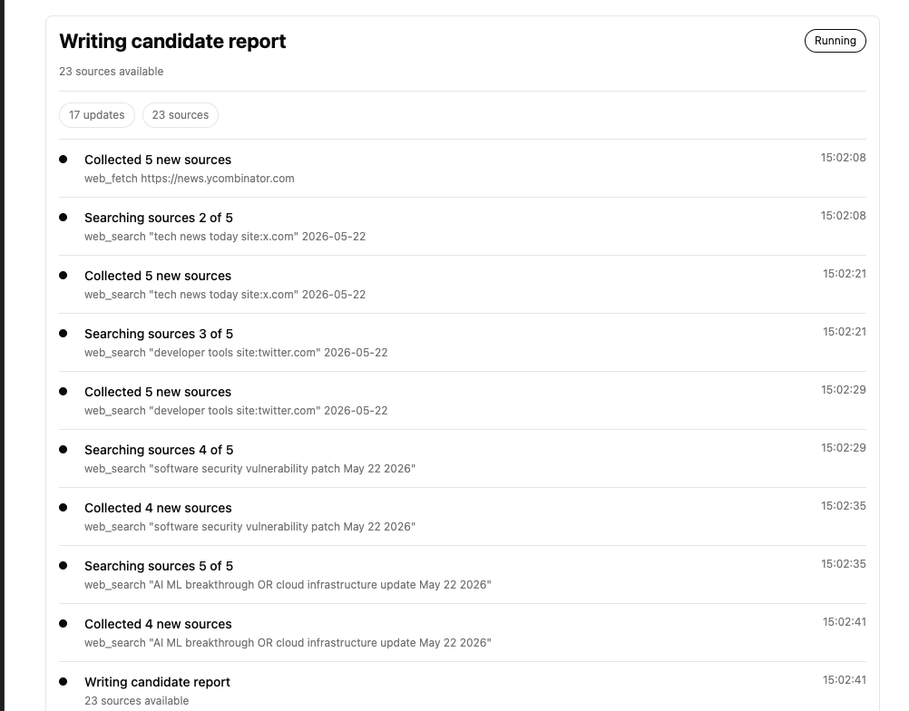

# ResearchLoop




`ResearchLoop` is a local research app for source-backed reports. It starts a
small browser UI on localhost, runs research on your machine, and writes every
artifact to plain files.

If you need a polished one-off report, use ChatGPT Deep Research, Perplexity,
NotebookLM, Elicit, or whatever tool is best for that job. That is not the thing
I am trying to replace here.

What I want here is different: I want to enter a research question, let the
local runner work through the topic, and still own the evidence. It should
search, snapshot sources, write a candidate report, check whether the claims are
cited, keep the report only if it improves the previous one, and leave me enough
files to understand what happened.

If the answer is bad, I do not want to guess why. I want to see the sources, the
claims, the prompt, the score, the gaps, and the discarded attempts.

The core loop is deliberately simple:

```text
plan queries -> collect source snapshots -> write candidate report
             -> verify claims and citations -> keep/discard -> repeat
```

The point is to own the research operation: source policy, source snapshots,
claim records, evaluator notes, iteration history, repeatable reruns, and
publishing hooks for recurring workflows.

## What This Is For

This starts to matter when the same kind of research has to happen again and
again, and the process matters as much as the final answer:

- daily tech briefings;
- security and vulnerability watchlists;
- market or industry monitoring;
- research over internal notes plus web sources;
- reports that need an audit trail, not just a final paragraph.

If the output needs to become a daily briefing, a watchlist, a report archive, a
Notion page, or an internal workflow, then I want the research process to be
programmable and inspectable instead of hidden inside a chat session.

## Use It

Configure an OpenAI-compatible endpoint and Tavily in `.env`, then start the
local UI:

```bash
python -m researchloop ui
```

Open [http://127.0.0.1:8787](http://127.0.0.1:8787).

Use `New` to start research. The run panel shows a live activity feed for
workspace setup, query planning, source collection, report writing, citation
checking, and saving. Use `Researches` to reopen previous local workspaces or
delete one after review. Deleting a research removes its local workspace
directory. The UI creates normal directories under
[`workspaces/`](workspaces/); it does not use a database or trap the result
inside the browser.

## How It Works

The repo is intentionally small. A research topic becomes a directory of plain
files. The UI is a thin shell over the same runner. The workspace stores the
topic, run config, source policy, source snapshots, candidate reports, claim
records, evaluator notes, and iteration log.

The important files are the interface:

- [quality-bar.md](quality-bar.md): target level, bench gate, and tool admission rules.
- [program.md](program.md): operating instructions for bounded research runs.
- [run_config.json](run_config.json): default run behavior copied into each workspace.
- [source_policy.json](source_policy.json): source-selection rules copied into each workspace.
- [`workspaces/<name>/`](workspaces/): generated research workspace directory.
- `workspaces/<name>/topic.md`: the research question and constraints.
- `workspaces/<name>/run_config.json`: how this workspace runs.
- `workspaces/<name>/source_policy.json`: source rules for this workspace.
- `workspaces/<name>/sources.jsonl`: source snapshots with stable IDs like S1.
- `workspaces/<name>/claims.jsonl`: kept claim records with source IDs.
- `workspaces/<name>/report.md`: current best report.
- `workspaces/<name>/eval.md`: verifier summary for the current best report.
- `workspaces/<name>/results.tsv`: iteration log.
- `workspaces/<name>/state.json`: current best score and iteration.
- `workspaces/<name>/iterations/`: candidate artifacts for every run.

By design, `report.md` is not overwritten just because the model wrote
something new. A candidate has to beat the current score. If it loses, the
candidate is discarded as the current report but preserved under `iterations/`
so the failure can still be inspected.

The metric is intentionally practical. It is not a truth oracle. It rewards
cited claims, source coverage, expected structure, and visible open gaps. It
penalizes unsupported claims and thin evidence. The metric exists so the loop has
a repeatable signal, not so humans can stop reviewing the result.

## Project Structure

- [researchloop.py](researchloop.py): module entrypoint.
- [cli.py](cli.py): command-line interface.
- [ui.py](ui.py): local browser UI.
- [core.py](core.py): workspace lifecycle and keep/discard loop.
- [llm.py](llm.py): OpenAI-compatible chat-completions adapter.
- [search.py](search.py): search backend adapter.
- [run_config.py](run_config.py): run configuration loading and validation.
- [source_policy.py](source_policy.py): source policy loading and URL filtering.
- [scoring.py](scoring.py): transparent verifier score.
- [prompts.py](prompts.py): planning and synthesis prompts.
- [models.py](models.py): source, claim, report, evaluation records.
- [storage.py](storage.py): plain-file persistence helpers.

[program.md](program.md) is the human-facing operating document: it tells an
agent how to run bounded research work. [source_policy.json](source_policy.json)
is where source rules live. The Python files are the runner; the workspace files
are the research record.

## Verification

The verifier is intentionally transparent. It does not prove truth. It checks
whether the report is operationally usable:

- every substantive claim should cite source IDs like `[S1]`;
- claim records must point to known sources;
- cited sources should contain enough meaningful claim terms to count as
  textually supportive;
- the report should use multiple cited sources where possible;
- the report should include the expected sections;
- open gaps should be recorded instead of hidden;
- unsupported claims and excessive gaps lower the score.

This gives a repeatable signal for citation discipline and auditability. Human
review is still required for legal, medical, financial, policy, security, or
other high-stakes research.

## Configuration

`run_config.json` chooses the model backend. The local default is native Gemini
through Google's `generateContent` API. OpenAI-compatible chat completions are
still supported for other providers.

For Gemini, keep the API key in `.env`; `GEMINI_MODEL` and
`GEMINI_THINKING_BUDGET` are optional. For OpenAI-compatible providers, use the
existing `OPENAI_COMPAT_*` settings. Markdown synthesis remains the default
because it works across providers.

## Search Policy

Manual source ingestion works without a search API. Automated web search uses
Tavily when `TAVILY_API_KEY` is set and the workspace `run_config.json` says
`"search_backend": "tavily"`.

Source-selection rules belong in `source_policy.json`, and `researchloop init`
copies that policy into every workspace so runs remain auditable.

```json
{
  "search_depth": "advanced",
  "start_date": null,
  "end_date": null,
  "time_range": null,
  "extract_after_search": true,
  "extract_depth": "basic",
  "extract_format": "markdown",
  "include_domains": [],
  "exclude_domains": [
    "facebook.com",
    "instagram.com",
    "medium.com",
    "quora.com",
    "reddit.com",
    "youtube.com"
  ]
}
```

Use `include_domains` when a topic should be constrained to known primary
sources. Use `exclude_domains` to remove low-signal domains. Use
`"time_range": "day"` for current-day research. By default, Tavily search
results are enriched through Tavily Extract so the stored source snapshots have
cleaner page content than search snippets alone.

`run_config.json` controls how new workspaces run. That is intentional. I want
the behavior of a research run to live with the research record, not in a long
command that disappears from history.

The checked-in default is source-backed web research:

```json
{
  "backend": "gemini",
  "search_backend": "tavily",
  "synthesis_mode": "markdown",
  "max_results": 5,
  "iterations": 1,
  "min_delta": 0.1
}
```

The kept answer is written to `workspaces/software-news/report.md`. The same
workspace also keeps `sources.jsonl`, `eval.md`, `results.tsv`, and every
candidate iteration for audit.

The CLI still exists for agents and power users:

```bash
python -m researchloop init software-news "What changed in software this week?"
python -m researchloop run workspaces/software-news
```

## Design Choices

- **Plain files over hidden state.** Research artifacts should be readable,
  diffable, commit-friendly, and easy to move.
- **OpenAI-compatible endpoint.** The runner should work with any compatible
  `/chat/completions` provider, not a single vendor API.
- **Workspace config over command flags.** The UI is the normal path. When the
  CLI is used, run settings still come from plain files beside the research
  artifacts.
- **Local UI as a thin shell.** `researchloop ui` starts a small localhost app
  over the same runner. The browser is a control surface, not a second product
  path.
- **Source policy is code-like config.** Search rules belong in
  `source_policy.json`, not buried inside prompts or environment variables.
- **Keep/discard is the control loop.** The current report changes only when a
  candidate improves the score; bad runs remain inspectable.
- **The verifier is humble.** It checks evidence hygiene. It does not certify
  truth, investment advice, medical advice, legal advice, or anything else that
  needs human judgment.

## Current Limits

- Source quality is better with extraction, but social feeds and front pages can
  still return truncated or noisy records without a browser or official API.
- Date filters depend on provider publish/update metadata. Pages without usable
  date metadata can still need human review.
- The verifier checks citation discipline, structure, and lightweight textual
  support, not factual truth.
- Transient provider failures are retried, but there is no budget policy,
  model-fallback policy, or job queue yet.
- If a Markdown synthesis request times out, the runner retries once with a
  smaller source pack before failing the iteration.
- The UI is local-only. There is no hosted product, auth, or database.

## Notable Links

- [`karpathy/autoresearch`](https://github.com/karpathy/autoresearch)
